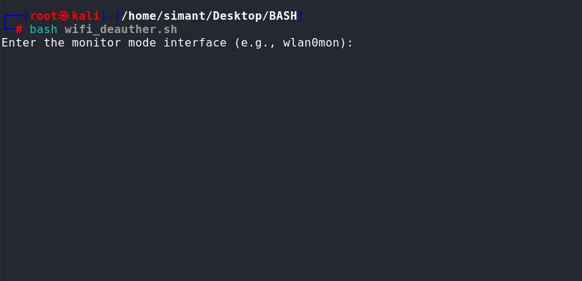

WiFi Deauther – Bash Script

 💀 A simple Bash-based WiFi deauthentication tool for educational and controlled penetration testing environments.

⚠️ Disclaimer:
This tool is for educational use only in your own network or a lab environment.
Unauthorized deauthentication attacks are illegal.
